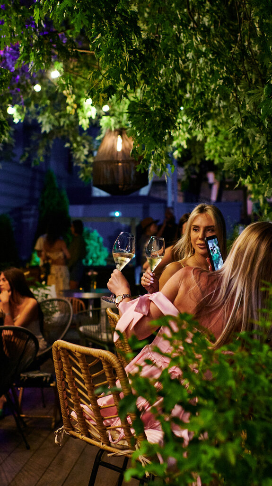
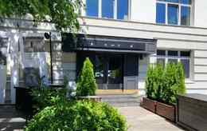
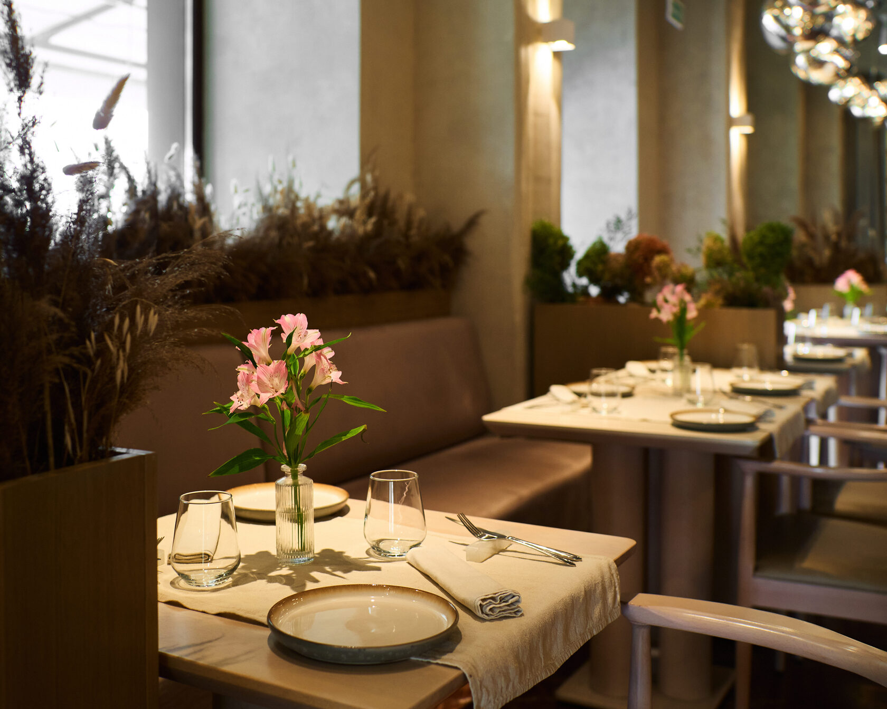
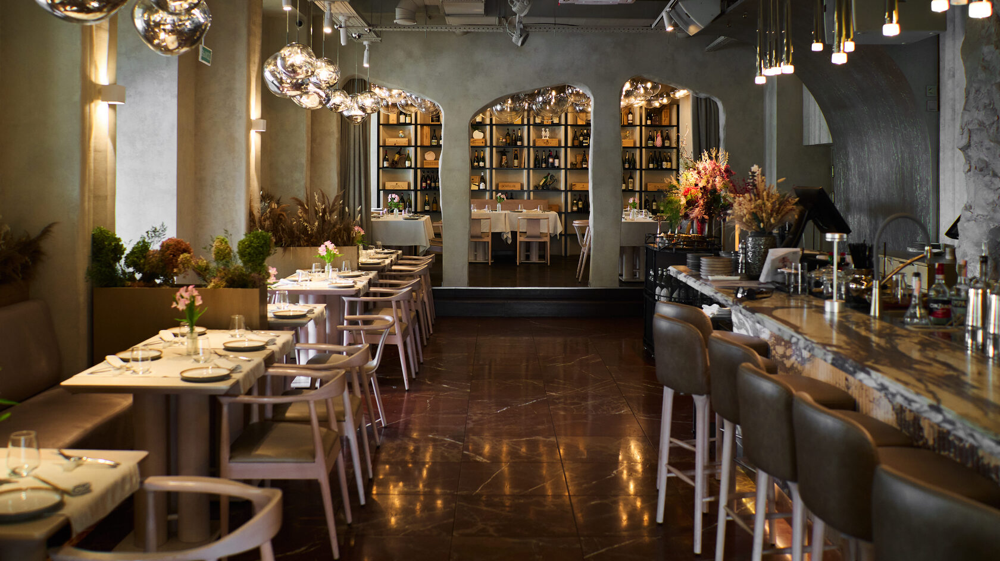
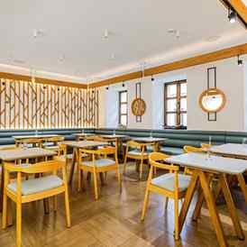
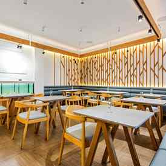

# Проекты

Запускал и перезапускал заведения с нуля — от концепции и стройки до сбора команды, выстраивания процессов, P&L и работы с поставщиками и контролирующими органами.

## Список проектов

- Heroes Play-Bar
- SAVA Bar
- Юнистор Групп (ритейл)
- Marbl Restaurant
- Umami / Ресторан «Дом»
- Studio Wine & Spirits

---

## 🍸 Heroes Play-Bar

**Управляющий · окт. 2025 – июль 2026 · Минск**

Бар с нуля — от стройки до открытия. Переработал концепцию меню и барной карты, модернизировал звуковое и техническое оснащение площадки. Написал ТЗ и внедрил собственное программное обеспечение, связал систему бронирования с CRM «Битрикс24».

---

## 🌃 SAVA Bar

**Управляющий директор · окт. 2023 – янв. 2025 · Минск**

Перезапуск действующего заведения в новом, ночном формате — новая концепция целиком и полный пакет разрешительной документации.

---

## 🛒 Юнистор Групп — ритейл

**Менеджер по развитию · июль 2023 – июль 2024 · Минск**

Розничная продуктовая сеть — единственный проект вне ресторанного мира. Развивал ассортимент сети, искал операторов под проект «7 пятниц XXL» и отдельно прокачивал ассортимент для Horeca-подразделения UNISTOR.

---

## 🍽️ Marbl Restaurant

**Управляющий директор рестораном · май 2020 – авг. 2023 · Минск**

Премиальный ресторан с нуля: концепция и дизайн. Разработал программы обучения и стандарты обслуживания, вёл контроль бюджета через ABC-анализ. Развивал B2B-продажи через корпоративных клиентов и мероприятия, а вместе с шеф-поваром балансировал креативность меню и рентабельность.

---

## 🍱 Umami / Ресторан «Дом»

**Управляющий директор · дек. 2019 – дек. 2020 · Минск**

Одновременное управление двумя заведениями: запуск концепции неоресторана Umami и ведение ресторана «Дом», включая маркетинговые стратегии и выполнение планов продаж по обоим объектам.

---

## 🍷 Studio Wine & Spirits

**Управляющий директор · май 2017 – июнь 2020 · Минск**

Ресторанно-винный магазин. Построил систему мотивации персонала, нацеленную на удержание ключевых сотрудников и достижение KPI.
